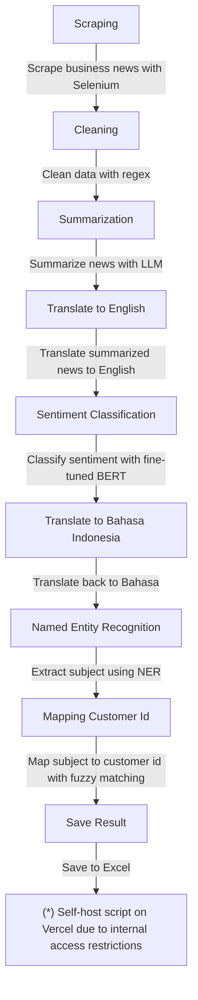

  <h3 align="center">News Scraping</h3>

  

  The need for business news data needed as additional information to analyze the financial condition of customers in the bank sector

    

---

### Program Tasks

1. **Scraping**   *Scrape business news topic from google news with python selenium.*
2. **Cleaning**   *Clean scraped data with regular expression (regex) from unnecessary pattern, such as advertisement, multiple whitespace, etc.*
3. **\*Summarization**   *Summarize news content into 3 sentences using Large Language Model (LLM).*
4. **\*Translate to English**   *Translate summarized news to english.*
5. **Sentiment Classification**   *Classify sentiment translated news using fine-tuned BERT.*
6. **\*Translate to Bahasa Indonesia**   *Translate back news to Bahasa Indonesia.*
7. **Named Entity Recognition**   *Extract existing subject from summarized news using Named Entity Recognition (NER).*
8. **Mapping Customer Id**   *Map extracted subject with customer id to get customer id using fuzzy matching.*
9. **Save Result**   *Save result to excel file.*

*Note*  
(*): Script needs to be self-hosted (Vercel) because provider-hosted api (openai and google translate) is not accessible in internal environment. 

---

### Libraries

### Cloud Hosting

